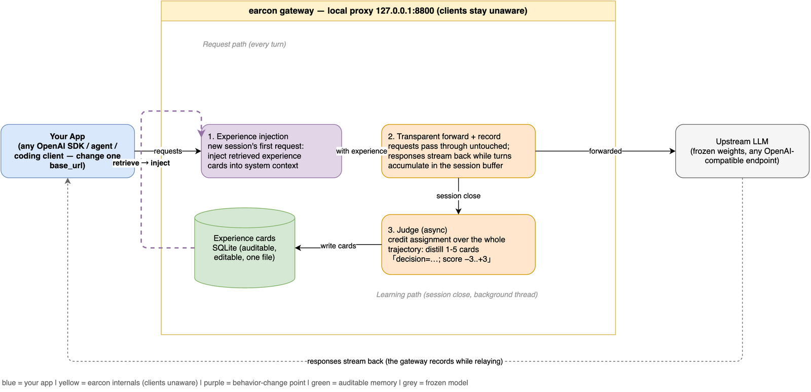

# earcon

**A self-evolving memory proxy for OpenAI-compatible clients.**
Point your app's `base_url` at earcon, keep working normally - the model
starts learning from every session, with **zero weight updates** and
**zero client changes beyond one URL**.

- **What it is**: a local proxy that records your LLM sessions, has a
  judge distill them into experience cards (a decision + a score), and
  injects the relevant experience into future similar sessions.
- **What it is not**: not fine-tuning, not another RAG memory of user
  facts. It stores *behavioral* experience with returns - "this approach
  worked, that one failed" - and changes decisions, not just knowledge.
- **Lineage**: mechanisms from [JitRL: Just-In-Time Reinforcement
  Learning](https://arxiv.org/abs/2601.18510) (ICML 2026 Spotlight):
  non-parametric experience memory, advantage estimation, and
  experience-driven action reweighting - realized for free-text agents.

```
your app (any OpenAI SDK / LangGraph / coding client ...)
        │  change one base_url
        ▼
   earcon gateway ──① inject experience──▶ upstream LLM (frozen weights)
        │ ② record every turn
        ▼
   ③ judge on session close ──▶ ④ SQLite experience cards ──▶ back to ①
```



## Why not just mem0 / Letta / Zep?

Those store *facts* ("the user prefers concise answers") and retrieve
them into context. earcon stores **scored behavior** and follows the
JitRL loop:

| | fact memories (mem0 et al.) | earcon |
|---|---|---|
| Stored unit | "user likes X" | "decision D on task T scored -3" |
| Signal | none (storage only) | return / judge credit assignment |
| Changes decisions? | indirectly, via recall | directly - experience is *retrieved by task similarity and weighted by outcome* |
| Auditable | depends | one SQLite file, every card inspectable |
| Intrusive | SDK / API changes | one `base_url` swap |

## Quickstart

```bash
pip install "earcon[gateway,openai]"

# terminal 1: run the gateway against any OpenAI-compatible upstream
earcon serve --upstream https://api.openai.com/v1 \
    --api-key $OPENAI_API_KEY --judge-model gpt-4o-mini

# terminal 2: any OpenAI app, one line changed
#   OpenAI(base_url="http://127.0.0.1:8800/v1", ...)
python examples/quickstart_client.py
```

Work normally. Sessions close (30 min idle, or explicit
`POST /v1/earcon/session/default/close`), the judge distills cards,
and future similar requests arrive pre-loaded with your own track
record:

```bash
curl http://127.0.0.1:8800/v1/earcon/stats
# {"cards": 14, "sessions_open": 1, "inject": true}

sqlite3 earcon_memory.db "SELECT task, action, G FROM cards LIMIT 5"
```

**Start in observation mode** while you assess your judge's card
quality: `earcon serve ... --no-inject`. The judge is the quality
ceiling of the whole system.

## Does it actually work?

The discrete-action path is verified in `examples/treasure_maze/` - a
toy environment where traps sit on the intuitive routes, so avoiding
them is *only* knowable through experience:

```bash
# control arm (frozen behavior):      ~2% win, 4.0 trap falls / episode
python examples/treasure_maze/run.py --episodes 150 --seed 2 --no-memory

# earcon learning arm:                 ~43% win (up to 100% in late windows),
python examples/treasure_maze/run.py --episodes 150 --seed 2
#                                      1.0 falls/episode, 10.5 steps vs 6 optimal
```

The learned advantage at the trap-adjacent cells comes out correctly
signed - memory, not luck. See `docs/how-it-works.md` for the full
loop, and the honest list of conditions under which it *won't* work.

## How it works

1. **Record** - every turn flows through the gateway transparently
   (streaming included) into a session buffer.
2. **Judge** - on session close, a background judge call distills 1-5
   experience cards ("decision=...; score -3..+3").
3. **Retrieve & inject** - the next session's first user message is
   matched against past cards; the top matches join the system prompt.

For **enumerable action spaces** (agents, tools), `earcon.core`
implements the paper's full path: per-option logits from `logprobs`,
advantage `A = Q - V` with small-sample shrinkage, and the closed-form
update `z' = z + βA`. The maze example runs it end to end.

Details and design corrections: `docs/how-it-works.md` · client
integration guide: `docs/client-integration.md`.

## Configuration

`earcon serve --upstream URL --judge-model M [--api-key K]
[--db FILE] [--port 8800] [--no-inject] [--session-timeout 1800]
[--inject-top-k 5] [--judge-extra-body '{"thinking":{"type":"off"}}']`

- Credentials: `EARCON_API_KEY` env var or `--api-key`. The gateway
  rewrites client keys with its own, so clients need no real key.
- Vendor-private judge parameters (e.g. disabling a reasoning mode for
  the scoring call) go through `--judge-extra-body`; nothing
  non-standard is sent by default.

## Honest limitations

- **The judge is the ceiling.** A shallow judge produces noisy cards;
  start with `--no-inject` and audit them.
- **Injection, not logits, on the main path** - most hosted gateways
  don't expose `logprobs`, so free-text learning happens through
  context. The full logit path needs a `logprobs`-capable upstream
  (vLLM etc.) and lives in `earcon.core`.
- **Cold start requires a working base.** If the model never succeeds,
  there are no positive cards to reinforce (JitRL has the same
  constraint). Rough sweet spot: base success in the 20-60% band.
- **Single-user, single-process.** No multi-tenant isolation; memory is
  one SQLite file. The session reaper is a background thread, not a
  distributed system.
- **Task matching is keyword-based.** Deliberately (it beat embeddings
  in our maze experiments and needs no infra), but it's simple.

## Roadmap

- [ ] Hermes agent `MemoryProvider` adapter
- [ ] Server-side logit bias via vLLM `logit_bias` (true step-level steering)
- [ ] Card editor / curation CLI
- [ ] Multi-namespace memory (per-project, per-tenant)

## License

Apache-2.0. Built on the mechanisms of [JitRL](https://arxiv.org/abs/2601.18510)
(Barrett et al.) - if you use earcon in research, please cite the paper.
