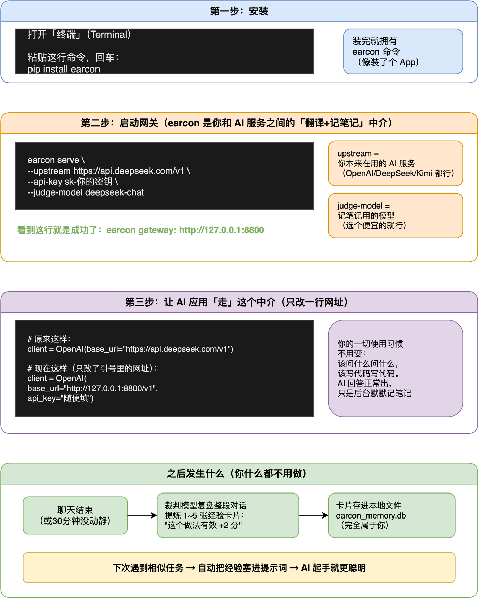

# earcon 新手使用指南

> 写给完全没接触过命令行工具的新手。跟着做，10 分钟内让 AI 开始"越用越懂你"。
> 全程只需要复制粘贴，不需要懂原理。

---

## 先搞明白：earcon 是干嘛的？

一句话：**它是一个"中介"，住在你的 AI 应用和 AI 服务之间，一边正常传话，一边偷偷记笔记。**

- 你平时用 AI 的方式**完全不变**：该聊天聊天，该写代码写代码；
- 中介会把每次对话记下来，聊完后请一个"裁判 AI"复盘：哪些做法有效、哪些踩了坑；
- 下次你再遇到**相似的问题**，中介会把这些经验悄悄塞给 AI——所以 AI 会**越来越懂你的工作方式**；
- 笔记存在**你自己电脑上的一个文件里**，随时可以看、可以删，不经过任何第三方。

```
┌─────────────┐      ┌─────────────┐      ┌─────────────┐
│  你的 AI 应用  │ ───▶ │ earcon 中介  │ ───▶ │  AI 服务      │
│（聊天/写代码） │ ◀─── │（传话+记笔记）│ ◀─── │(DeepSeek 等) │
└─────────────┘      └─────────────┘      └─────────────┘
```

> 🤔 **它会不会把我 AI 用得变慢/变笨？** 不会。传话是原样转发的，你感知不到任何差别。记笔记是在"聊天结束后"后台进行的，不影响你的使用。

---

## 准备工作（2 分钟）

开始前，请确认你手上有这两样东西：

1. **一个 AI 服务的 API Key**（就是你本来在用的那个，形如 `sk-xxxxx` 的密钥）。还没有的话，去 [DeepSeek](https://platform.deepseek.com)、[Kimi](https://platform.moonshot.cn) 或 [智谱](https://open.bigmodel.cn) 注册一个，几块钱能用很久；
2. **一台装了 Python 的电脑**（Mac 自带；Windows 去python.org 下载安装，安装时勾选 "Add Python to PATH"）。

> 🤔 **什么是 API Key？** 相当于你在 AI 服务那里的"门卡"。AI 服务按用量扣费，所以门卡别借给别人——本教程也会教你把它安全地交给 earcon 保管。

---

## 第一步：安装（1 分钟）

打开「终端」：

- **Mac**：按 `Command + 空格`，输入"终端"或"Terminal"，回车；
- **Windows**：开始菜单搜"PowerShell"或"cmd"，回车。

在里面粘贴这行命令，然后回车：

```bash
pip install earcon
```

屏幕会滚动安装进度，最后没报红色错误就是成功了。



> 💡 **报错了怎么办？** 最常见的是 `pip: command not found`——说明 Python 没装好或没加入 PATH。Mac 用户可以试试 `pip3 install earcon`（多个 3）；还不行就去搜"Python 安装教程"先补一下基础，10 分钟的事。
>
> 💡 **装的时候提示 pip 版本太旧？** 跑一下 `python3 -m pip install --upgrade pip` 再重试。

---

## 第二步：启动中介（2 分钟）

> **这里有个关键概念要先讲清楚**：earcon 网关只负责"记笔记"这一件事。
> 你干活的 AI（kimi、GLM、GPT……）**不用在这里配置**——它的地址和密钥
> 一直在你自己的应用里（ZCode/Codex 的供应商设置里），earcon 只是原样转发。
> 你要在启动命令里配的，只有一件事：**谁来当"裁判"（复盘打分的模型）**。

继续在终端里粘贴这段命令（**三处换成你裁判服务的信息**）：

```bash
earcon serve \
  --judge-upstream https://api.deepseek.com/v1 \
  --judge-api-key sk-裁判服务的密钥 \
  --judge-model deepseek-chat
```

三部分含义（对照上图第二栏）：

| 参数 | 填什么 | 说明 |
|---|---|---|
| `--judge-upstream` | 裁判服务的接口地址 | 配一次，之后不管你干活用 kimi/GLM/GPT，复盘永远走这里 |
| `--judge-api-key` | 裁判服务的密钥 | 只用于复盘调用，和你干活的密钥完全独立 |
| `--judge-model` | 裁判模型名 | 选个便宜的就够，比如 `deepseek-chat`（复盘不需要旗舰模型） |

看到这两行，就代表成功了：

```
earcon gateway: http://127.0.0.1:8800
work channel: pass-through (clients keep their own upstream+key)
judge channel: deepseek-chat -> https://api.deepseek.com/v1
```

**这个终端窗口别关**（关了中介就下班了）。想让它常驻后台，Mac 可以在命令前加 `nohup`、结尾加 `&`。

> 🤔 **`127.0.0.1:8800` 是什么？** 就是你自己电脑的"门牌号"。earcon 住在你电脑上，只有你能访问，聊天内容不会被传到 earcon 的服务器——因为它根本没有服务器。
>
> 🤔 **干活和裁判可以是不同厂商吗？** 完全可以。这就是把裁判单独配置的原因：比如干活用 Kimi（Kimi 的地址和密钥一直在你应用里），裁判用免费的 GLM——两边互不干扰。

---

## 第三步：让 AI 应用改走中介（3 分钟）

这是唯一需要"动一下"你应用的地方：**把 AI 接口地址改成 earcon 的门牌号**。不同的工具改法不同，下面按常见场景给片段。

### 场景 A：你写 Python 代码调 AI

找到代码里创建客户端的那行，只改 `base_url`：

```python
# 原来是这样：
client = OpenAI(
    base_url="https://api.deepseek.com/v1",
    api_key="sk-你的密钥",       # ← 你干活的 key 留在原地
)

# 改成这样（只改了网址；密钥留着你原来的，earcon 会原样透传）：
client = OpenAI(
    base_url="http://127.0.0.1:8800/v1",
    api_key="sk-你的密钥",       # ← 这行一个字都不用动
)
```

其他代码**一个字都不用改**，照常运行即可。

### 场景 B：你用 ZCode / Codex 这类编程助手

在设置里添加一个"自定义模型供应商（OpenAI 兼容）"：**接口地址**填 `http://127.0.0.1:8800/v1`，**模型名**填你本来用的名字（如 `deepseek-chat`），**密钥填你本来的真实密钥**（earcon 会原样透传给上游，不会替换）。之后选这个供应商干活就行。

> ⚠️ **Claude Code 用户注意**：它用的是另一种协议（Anthropic 协议），目前不能直接接 earcon，我们在做适配，请先关注项目更新。

---

## 第四步：什么都不做（真的）

从现在起，正常用你的 AI。前几次对话你感觉不到任何变化——**因为笔记是从零开始记的，第一次对话只是在"上课"**。

时间线是这样的（对照上图第四栏）：

```
第 1 次对话 ──► 正常问答 + 后台记录
对话结束     ──► 裁判 AI 复盘，提炼经验卡片存入本地
第 2 次相似任务 ──► 经验自动注入，AI 起手就带着"上次的记忆"
几周之后     ──► 你有了一本完全属于自己的经验库
```

---

## 怎么知道它在干活？（查看进度）

新开一个终端窗口，粘贴：

```bash
curl http://127.0.0.1:8800/v1/earcon/stats
```

会返回类似：

```json
{"cards": 14, "sessions_open": 1, "inject": true}
```

- `cards`：已经记下的经验卡片数（会慢慢涨）；
- `sessions_open`：当前开着的对话数。

**看具体的笔记内容**（这就是"审计"）：

```bash
sqlite3 earcon_memory.db "SELECT id, task, action, G FROM cards ORDER BY id DESC LIMIT 10"
```

每张卡片长这样：`任务是什么 → 做了什么决策 → 得分多少`（正分=有效，负分=踩坑）。

**删掉一条学坏的记忆**（比如发现某条卡片是错的）：

```bash
sqlite3 earcon_memory.db "DELETE FROM cards WHERE id = 卡片编号"
```

---

## 两个强烈建议

### 建议 1：先"只记不看"，观察几天再开注入

第一次用，可以加个 `--no-inject` 参数启动：

```bash
earcon serve --judge-upstream ... --judge-api-key ... --judge-model ... --no-inject
```

这模式下 earcon **只记笔记、不干预对话**。你先跑两三天，用上面的 sqlite 命令看看"裁判"记的笔记质量如何——觉得靠谱了，去掉这个参数重启，正式开启"越用越聪明"。

> 为什么？因为裁判是个 AI，它偶尔也会记错笔记。先看货再上车，是稳妥的做法。

### 建议 2：不同用途用不同的笔记库

如果你同时用它跑"写周报"和"改代码"，可以给它们分不同的数据库文件，互不干扰：

```bash
# 周报专用
earcon serve --db weekly_report.db --port 8800 ...
# 写代码专用
earcon serve --db coding.db --port 8801 ...
```

（注意端口也要不同，否则第二个起不来。）

---

## 常见问题

<details>
<summary><b>关掉终端后，AI 应用连不上了？</b></summary>

earcon 网关跟着终端一起关闭了。重新跑一遍第二步的启动命令即可。想一劳永逸：Mac 上可以做成"登录时自动启动"（launchd），或者简单点——开个专门的终端窗口放着不关。
</details>

<details>
<summary><b>聊天记录会不会泄露？</b></summary>

三个环节：① earcon 住在你本机，笔记只存在本地文件里；② 它转发请求只会到你自己配置的那个 AI 服务（和平时直连一样）；③ 唯一新增的调用是"裁判复盘"，也是打到你自己的 AI 服务。**earcon 本身没有任何云端服务器。** 但注意：你的对话内容本来就会经过你选的 AI 服务商（这和你直接用它没区别），敏感内容请自行斟酌。
</details>

<details>
<summary><b>什么时候能感觉到效果？</b></summary>

经验是按"相似任务"匹配的——重复性高的场景（同类报错反复修、同类文档反复写）见效最快，通常几次对话后就有感；每次都是全新领域的话，短期内感受不明显（没有可复用的经验）。把它放在你最常干的那类活上，价值最大。
</details>

<details>
<summary><b>怎么彻底卸载？</b></summary>

```bash
pip uninstall earcon          # 卸载程序
rm earcon_memory.db           # 删掉笔记库（确认不要了再删）
```
然后把应用里的 `base_url` 改回原来的地址。没有任何残留。
</details>

---

## 还想深入？

- 想知道它背后的原理（裁判怎么打分、经验怎么注入）→ [docs/how-it-works.md](./how-it-works.md)
- 各种客户端的详细接入方法 → [docs/client-integration.md](./client-integration.md)
- 想看它在玩具环境里"从 2% 考到 43%"的实测 → 项目首页的 Does it actually work? 一节

遇到问题？去 GitHub 仓库提 issue，附上 `curl http://127.0.0.1:8800/v1/earcon/stats` 的输出，会更容易得到帮助。
